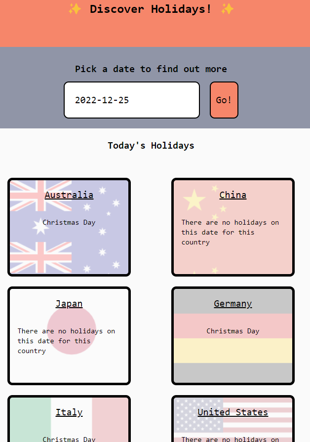

<h1>Holiday Calendar Discoverer</h1>

 
<!-- TABLE OF CONTENTS -->
  ## Table of Contents
  <ol>
    <li><a href="#summary">Summary</a></li>
    <li><a href="#description">Description</a></li>
    <li><a href="#technologies">Technologies</a></li>
    <li><a href="#user-stories">User stories</a></li>
    <li><a href="#challenges">Challenges</a></li>
    <li><a href="#license">License</a></li>
    <li><a href="#conclusion">Conclusion</a></li>
    <li><a href="#links">Links</a></li>
    <li><a href="#acknowledgments">Acknowledgments</a></li>
  </ol>
  
<!-- Summary -->
## Summary

A team of creative and enthusiastic web designers who love to explore new cultural aesthetics. Our project goal was to create an online application that allows users to browse, check and learn about different cultural events across ten countries for the year 2022. We used HTML & Tailwind CSS, MomentJS, JQuery and various APIs to build our application from scratch. Our application features a user-friendly interface, a dynamic calendar, animated gifs and informative content about each cultural event. Our application aims to provide users with an engaging and educational experience that enriches their cultural knowledge.

<!-- ABOUT THE PROJECT -->

## Description

<h2>Desktop View</h2>

 

<h2>Mobile view</h2>

 

 

<h2>Introduction</h2>
 
In this task, Group 5 was allocated to a challenge to create an online
application that allows us to brainstorm and apply our existing
knowledge base in creating an MVP offering.
In response, we have created a Cultural calendar that allows users to
browse, check and learn new cultural aesthetics across Ten different
countries for the Year 2022.
 
<h2>Acquired Knowledge</h2>
 
Whilst undertaking this project, we applied a range of web design
applications & techniques commencing from building the initial Bone
structure in style, and we used the following Technologies:
 
-  <strong>HTML & Tailwind CSS</strong> - During the Introductory phase, we applied
by building a concrete structure with CSS Style formats instead
as we wanted to try something different.
-  <strong>MomentJS</strong> - This intends to accept, parse and extract specific
dates in alignment with JQuery & relevant APIs applied.  
-  <strong>Fetched APIs</strong> - Used applications such as NagerAPI, GiphyAPI, and
Wikipedia API to extract data ranging from specific public
holidays, randomized animated gifs based on the initial event and
general information about the cultural traditions applied to that
public holiday event.
- <strong>JQuery</strong> - Comparatively, we used JQuery techniques in the
application to ensure the operational dynamics in building
different functions that work from behind the scenes to create a
more engaging user experience.
 

(<a href="#readme-top">back to top</a>)

<!--Technologies used-->
## Technologies

  

 
<!--User stories-->
## User stories
 
 <strong>As a User</strong>, I would like to cross-check my existing cultural
knowledge based on the available dates as shown on the calendar.
 
 <strong>As a User</strong>, I would like to learn about other cultural traditions
when researching on the same date of my choice during the Year
2022.
 
 <strong>As a User</strong>, I would like to get an overview of each month’s public
holiday events across different countries to pre-plan my
schedule.
 
  <strong>As a User</strong>, I would like to compare our cultural traditions in
alignment with other cultures based on the same selected date.
 

(<a href="#readme-top">back to top</a>)

 
<!--Challenges-->
## Challenges
Some of the challenges we experienced include the need to avoid
unnecessary & repetitive work overlaps for higher efficiency.
In the resolution, we have successfully prevented this by utilizing
our available class time, and student Slack channel as our group
openly communicated continuously in discussion for efficient problem
solving to prioritize reaching an optimal outcome.
 
- During this process, we compiled many different ideas before
reaching a mutual agreement that fulfills our group values in aid
of our assessment criteria.
- We expected to be challenged by the process of Git Push & Pull
procedures as we merge our updated repositories. We made multiple
attempts to push our final work output onto our GitHub branch as
our devices vary significantly.
We resolved this issue through trials and seeking help from our
mentors.
- Conversely, we had also realized that our production had
primarily focused on the user experience only when browsing our
online webpage, without realizing the importance of mobile users.
Thus, We had quickly amended towards the end.
 

(<a href="#readme-top">back to top</a>)

 
<!-- LICENSE -->
## License
 
Distributed under the MIT License. See `LICENSE.txt` for more information.
 

(<a href="#readme-top">back to top</a>)

 
 
<!-- CONTACT -->
## Conclusion
 
In conclusion, as for our future development, we intend to
continuously share and improve our existing product offering to
enhance the overall user experience.

We have demonstrated our skills and knowledge in web design by using various applications and techniques to build our application from scratch. Our application provides users with an engaging and educational experience that enriches their cultural knowledge. We hope that our project will inspire other web designers to explore new cultural aesthetics and create more innovative applications in the future.

(<a href="#readme-top">back to top</a>)

 
<!--Links-->
## Links
 
* URL - https://kangazero.github.io/holiday-calendar-discoverer/
* GitHub Repository - git@github.com:KangaZero/holiday-calendar-
discoverer.git
* MVP Pitch - https://prezi.com/view/WU2lpxAgEVgVD21urASU/
 
Here are some of the resources used as reference to build this holiday cultural calendar:
 
- [Nager API - Australia Public Holidays 2022](https://date.nager.at/PublicHoliday/Country/AU/2022)
- [Nager API - China Public Holidays 2022](https://date.nager.at/PublicHoliday/Country/CN/2022)
- [Nager API - Japan Public Holidays 2022](https://date.nager.at/PublicHoliday/Country/JP/2022)
- [Nager API - Germany Public Holidays 2022](https://date.nager.at/PublicHoliday/Country/DE/2022)
- [Nager API - Italy Public Holidays 2022](https://date.nager.at/PublicHoliday/Country/IT/2022)
- [Nager API - United States Public Holidays 2022](https://date.nager.at/PublicHoliday/Country/US/2022)
- [Nager API - New Zealand Public Holidays 2022](https://date.nager.at/PublicHoliday/Country/NZ/2022)
- [Nager API - Turkey Public Holidays 2022](https://date.nager.at/PublicHoliday/Country/TR/2022)
- [Nager API - Denmark Public Holidays 2022](https://date.nager.at/PublicHoliday/Country/DK/2022)
- [Nager API - Singapore Public Holidays 2022](https://date.nager.at/PublicHoliday/Country/SG/2022)
- [Media Wikipedia API](https://www.mediawiki.org/wiki/API:Main_page)
- [Gift Developer API](https://developers.giphy.com/)
- [Media Wikipedia API Test Result](https://en.wikipedia.org/w/api.php?action=query&list=search&srsearch=Australia%20Day)
- [Media Wikipedia API JSON Result - Australia](https://en.wikipedia.org/w/api.php?origin=*&action=parse&format=json&page=australia%20day)
- [MDN Webdoc - hsla() Function](https://developer.mozilla.org/en-US/docs/Web/CSS/color_value/hsla)
- [Stackoverflow - Background Image Opacity](https://stackoverflow.com/questions/64663368/background-image-with-opacity-in-tailwindcss)
- [DigitalOcean - How to change a CSS background images Opacity](https://www.digitalocean.com/community/tutorials/how-to-change-a-css-background-images-opacity)
- [Bulldog Job - How to write a Good ReadMe file](https://bulldogjob.com/readme/how-to-write-a-good-readme-for-your-github-project)
- [W3School - Window local storage ](https://www.w3schools.com/jsref/prop_win_localstorage.asp)
- [W3School](https://www.w3schools.com/)
 
 

(<a href="#readme-top">back to top</a>)

 
<!-- ACKNOWLEDGMENTS -->
## Acknowledgments
 
We would like to acknowledge and credit all contributors.
1. Yuhan Jiang (Cindy): [Github](https://github.com/CindzaJ)
    - Contributed to making our presentation, fetching our Nagerdate API Country parameters, Giphy API, and doing research on what countries to use, and their associated holidays. As well as doing our READme.md
 
2. Salina Myat: [Github](https://github.com/slingshort)
    - Contributed to making our pages very pretty through the use of TailwindCSS and base CSS. Along with fixing the skeleton framework for our index.html page. As well helping out on twerking javascript files.
 
3. Vidhi Sharma: [Github](https://github.com/Vidhi0307)
    - Contributed in fetching and rendering Nagerdate API data(objects) onto our index.html page, making our datepicker-UI, parse dates with moment.js, and largely responsible for our home.js (Index.html's javascript)
 
4. Samuel Yong: [Github](https://github.com/KangaZero)
    - As our Project Manager, Samuel was responsible to allocate our Team's available tasks on frequent basis, whilst also being responsive to testing for any relevant Trouble-shooting. 

(<a href="#readme-top">back to top</a>)

 
 

Thanks for reading 😄!

